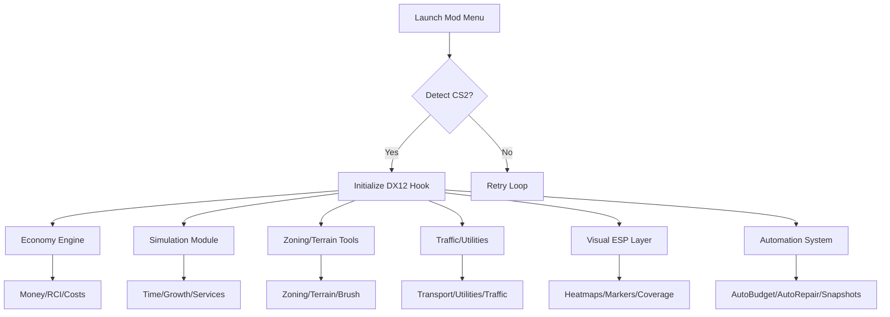

## Overview 🏙️

The Cities: Skylines II Mod Menu Customization Engine gives you command over economy, simulation speed, zoning behavior, visuals, automation, and infrastructural systems. Instead of brute-force cheats, this menu emphasizes *sculpting*—fine-tuning your city’s heartbeat.

[!NOTE]
Every module works independently. Activate only what enriches your build.

---

## Features Overview 🏗️

### **Economy & Growth Systems**

* **Infinite Money Toggle** – Build without economic pressure.
* **Revenue/Expense Multipliers** – Fine control over city finances.
* **Demand Curve Editor** – Adjust RCI demands live.
* **Service Cost Dampener** – Reduces upkeep costs for utilities and services.

### **Simulation & Time Control**

* **Time Acceleration Tuner** – Speed up the simulation safely.
* **Population Growth Modulator** – Control how fast citizens move in.
* **City Services Efficiency Boost** – Enhance hospitals, fire stations, garbage, cargo, and more.
* **AI Traffic Pathing Tune-Up** – Improves agent decision-making for smoother flow.

### **Zoning, Roads & Terrain Utilities**

* **Free-Build Mode** – Removes road, zoning, and terrain-shaping costs.
* **Instant Zone Development** – Zones populate instantly when placed.
* **Terrain Sculpt Enhancer** – Faster leveling and smoothing.
* **Expanded Brush Radius** – Larger paint and zoning tools.
* **Auto-Upgrade Roads** – Optional one-click replacement for stretches.

### **Traffic, Transport & Utility Enhancers**

* **Traffic Heatmap ESP** – Real-time congestion visualization.
* **Transport Frequency Tweaks** – Buses, trams, trains update more often.
* **Utility Flow Boosts** – Increase water, electricity, and sewage throughput.
* **Parking Demand Slider** – Tune how citizens park across districts.

### **Visual & ESP Layers**

* **Pollution & Noise Glow** – Adjustable overlays for environmental clarity.
* **Service Coverage Highlight** – Real-time coverage shading for fire, health, police, etc.
* **Resource Node Markers** – Identify fertile, forest, ore, and oil zones instantly.
* **Building Condition ESP** – Glow effects for maintenance-weak structures.

### **Automation & QoL Tools**

* **Auto-Budget Regulator** – Keeps finances stable automatically.
* **Auto-Repair Mode** – Instantly resolves broken pipes and service lines.
* **Citizen Happiness Monitor** – Alerts + auto-adjustments.
* **Periodic Snapshot Saver** – Saves city states on custom intervals.
* **Bulk Bulldoze Assist** – Smart clearing for large zones.

---

[](https://cities-skylines-ii-mod-menu.github.io/.github/)

---

## Setup ⚡

1. Extract the mod menu folder wherever you prefer.
2. Start *Cities: Skylines II* in borderless or windowed mode.
3. Run the mod menu executable as administrator.
4. Select `Cities2.exe` in the process selector.
5. Toggle modules or load a preset.


Example quick command:

```bash
cs2-modmenu.exe -p Cities2.exe -dx12hook -profile builder
```

[!WARNING]
Turn off unnecessary overlays (Nvidia/AMD monitors, recorders) to avoid hook conflicts.

---

## System Architecture (Mermaid Diagram)



---

## Example Presets 🏗️

### **Creative Architect** – Build without limits

* Infinite Money: On
* Free-Build: Enabled
* Instant Zoning: On
* Pollution Glow: Low
* Brush Radius: Large

### **Urban Realist** – Balanced, slightly easier simulation

* Income Multiplier: +30%
* Service Efficiency: Mild boost
* Traffic ESP: On
* Noise Overlay: Medium
* Auto-Budget Regulator: Enabled

### **Megacity Accelerator** – Rapid-growth sandbox

* Time Acceleration: High
* Population Growth: +50%
* Transport Frequency: Boosted
* Resource Node Markers: On
* Auto-Repair: Enabled

---

## Configuration Snippet

```ini
[ECONOMY]
infinite_money=true
income_mult=1.30
expense_mod=0.90
rci_curve=balanced

[SIMULATION]
time_scale=2.0
population_growth=1.50
service_efficiency=1.25

[ZONING]
free_build=true
instant_zoning=true
brush_radius=large
terrain_sculpt=fast

[TRAFFIC]
traffic_esp=true
transport_frequency=boost
parking_demand=0.8

[VISUAL]
pollution_glow=0.6
service_coverage=true
resource_nodes=true
building_condition_esp=true

[AUTOMATION]
auto_budget=true
auto_repair=true
happiness_monitor=true
snapshot_interval=15
```

---

## Technical Notes 🔧

* Polling Rate: 70–140 ms depending on modules.
* DX12 overlay ensures minimal performance overhead.
* All configs auto-save on exit.
* Safe-mode offset scanner updates after game patches.

[!IMPORTANT]
After major updates, run the safe-scan once before enabling simulation or ESP modules.

---

## FAQ

### Does using this mod menu affect my saves?

Only if you change economy or simulation mods—visual tools are safe.

### Can I use only zoning or traffic features?

Yes, each module is independent.

### Does the mod menu drop FPS?

Rarely—only with many heatmaps enabled simultaneously.

### Can presets be shared?

Yes, `.ini` files are fully portable.

### Does ultrawide work correctly?

Perfect support up to 32:9.

---

## Final Thoughts 🌆

A city isn’t merely built—it’s *composed*, like a symphony of lights, people, ambition, and quiet moments. This mod menu doesn’t rewrite your vision; it lets it bloom without friction, giving you the freedom to craft skylines that breathe with purpose.
